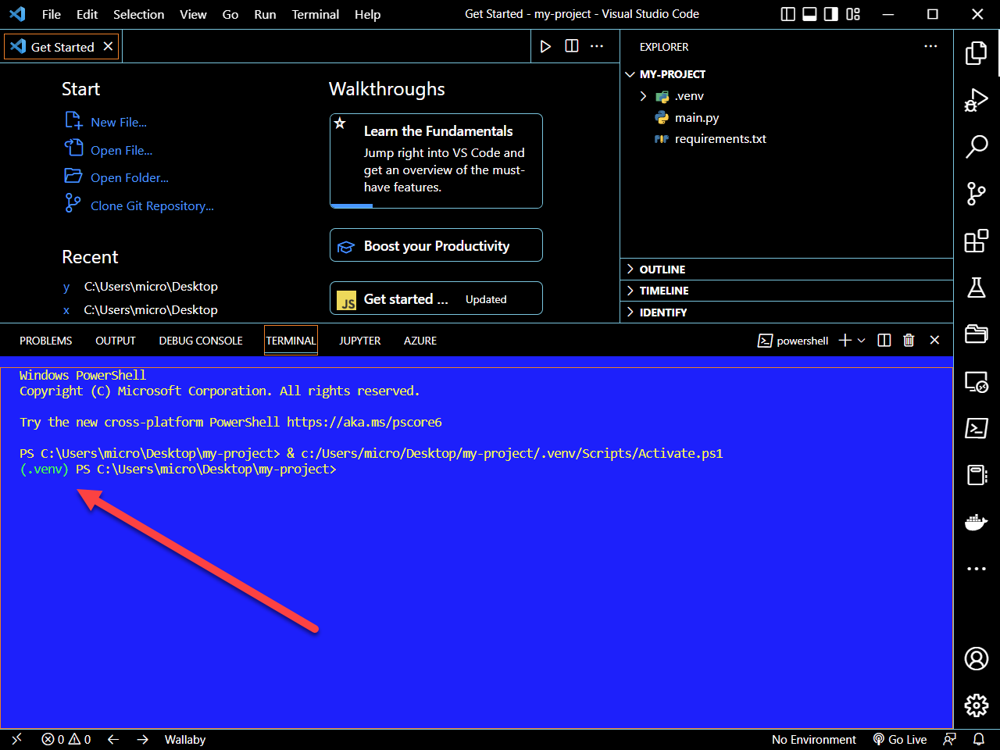

# 'Create Python Virtual Environment Here' PowerShell Script

[This is a simple PowerShell script](./src/create-venv-project-here.ps1) to create a [Python virtual environment project](https://docs.python.org/3/tutorial/venv.html).  Python version 3.3 or above, PowerShell, and [VS Code](https://code.visualstudio.com/) are required.  The steps to use this file are as follows:

1. Create a project folder and copy [`create-venv-project-here.ps1`](./src/create-venv-project-here.ps1) to it

2. Run [`create-venv-project-here.ps1`](./src/create-venv-project-here.ps1) using the project folder as the current working directory.

   ```powershell
   > powershell .\create-venv-project-here.ps1
    Python 3.10.5
    Creating a virtual environment  ...
    Activating virtual environment  ...
    Creating a requirements.txt and main.py file ...
    Opening VSCode ...
    Happy coding!
   ```

   The result will be a [Python virtual environment](https://docs.python.org/3/tutorial/venv.html) along with an empty `main.py` and `requirements.txt` file.  The virtual environment may also be activated by default but sometimes [VS Code](https://code.visualstudio.com/) has to be restarted for this to happen.

   

3. Simply delete `create-venv-project-here.ps1` as its not longer needed.

   ```bash
   del create-venv-project-here.ps1
   ```

   

   


